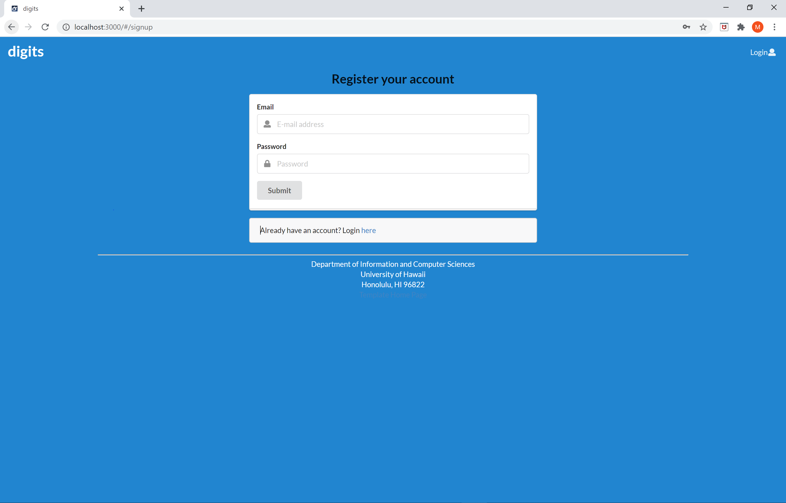

## Installation

Click the "Clone or download" button to download the GitHub repo to your local file system.  Using [GitHub Desktop](https://desktop.github.com/) is a great choice if you use MacOS or Windows.

Next, cd into the app/ directory of your local copy of the repo, and install third party libraries with:

```
$ meteor npm install
```

## Running the system

Once the libraries are installed, you can run the application by invoking the "start" script in the [package.json file](https://github.com/mikel-ishihara/digits/blob/cleanup/app/package.json):

```
$ meteor npm run start
```

The first time you run the app, it will create some default users and data. Here is the output:

```
meteor npm run start

> meteor-application-template-react@ start C:\Users\mikel\OneDrive\Desktop\github\digits\app
> meteor --no-release-check --exclude-archs web.browser.legacy,web.cordova --settings ../config/settings.development.json

[[[[[ C:\Users\mikel\OneDrive\Desktop\github\digits\app ]]]]]

=> Started proxy.
=> Started MongoDB.
I20201110-19:27:15.392(-10)? Creating the default user(s)
I20201110-19:27:15.393(-10)?   Creating user admin@foo.com.
I20201110-19:27:15.795(-10)?   Creating user john@foo.com.
I20201110-19:27:16.128(-10)? Creating default Contacts.
I20201110-19:27:16.128(-10)?   Adding: Johnson (john@foo.com)
I20201110-19:27:16.156(-10)?   Adding: Casanova (john@foo.com)
I20201110-19:27:16.158(-10)?   Adding: Binsted (admin@foo.com)
I20201110-19:27:16.259(-10)? Monti APM: completed instrumenting the app
=> Started your app.

=> App running at: http://localhost:3000/
   Type Control-C twice to stop.
```


### Note regarding "bcrypt warning":

You will also get the following message when you run this application:

```
Note: you are using a pure-JavaScript implementation of bcrypt.
While this implementation will work correctly, it is known to be
approximately three times slower than the native implementation.
In order to use the native implementation instead, run

  meteor npm install --save bcrypt

in the root directory of your application.
```

On some operating systems (particularly Windows), installing bcrypt is much more difficult than implied by the above message. Bcrypt is only used in Meteor for password checking, so the performance implications are negligible until your site has very high traffic. You can safely ignore this warning without any problems during initial stages of development.

### Viewing the running app

If all goes well, the template application will appear at [http://localhost:3000](http://localhost:3000).  You can login using the credentials in [settings.development.json](https://github.com/mikel-ishihara/digits/blob/cleanup/config/settings.development.json), or else register a new account.

### ESLint

You can verify that the code obeys our coding standards by running ESLint over the code in the imports/ directory with:

```
meteor npm run lint
```

## Walkthrough

The following sections describe the major features of this application.

### Directory structure

The top-level directory structure is:

```
app/        # holds the Meteor application sources
config/     # holds configuration files, such as settings.development.json
doc/        # holds developer documentation, user guides, etc.
.gitignore  # don't commit IntelliJ project files, node_modules, and settings.production.json
```

This structure separates documentation files (such as screenshots) and configuration files (such as the settings files) from the actual Meteor application.

The app/ directory has this structure:

```
client/
  main.html      # The boilerplate HTML with a "root" div to be manipulated by React.
  main.js        # import startup files.

imports/
  api/           # Define collections
    contact/     # The Contacts collection definition
    note/        # The Notes collection definition
  startup/       # Define code to run when system starts up (client-only, server-only, both)
    client/
    server/
  ui/
    layouts/     # Contains top-level layout (<App> component).
    pages/       # Contains components for each page.
    components/  # Contains page elements, some of which could appear on multiple pages.

node_modules/    # managed by npm

public/          # static assets (like images) can go here.

server/
   main.js       # import the server-side js files.
```

#### Landing page

When you retrieve the app at http://localhost:3000, this is what should be displayed:


The next step is to use the Login menu to either Login to an existing account or register a new account.

#### Login page

Clicking on the Login link, then on the Sign In menu item displays this page:


#### Register page

Alternatively, clicking on the Login link, then on the Sign Up menu item displays this page:



#### Landing (after Login) page, non-Admin user

Once you log in (either to an existing account or by creating a new one), the navbar changes as follows:


You can now add new contacts, and list the contacts you have created. Note you cannot see any contacts created by other users.

#### Add Contact page

After logging in, here is the page that allows you to add new contact:


#### List Contacts page

After logging in, here is the page that allows you to list all the contacts you have created:


You click the "Edit" link to go to the Edit Contact page, shown next.

#### Edit Contact page

After clicking on the "Edit" link associated with an item, this page displays that allows you to change and save it:


### Add a Timestamped note

There is a textbox where you can add a note for a specific contact with the associated date:


Once you click the submit button, that note will be attached to the contact:


#### Landing (after Login), Admin user

You can define an "admin" user in the settings.json file. This user, after logging in, gets a special entry in the navbar:


#### Admin page (list all users stuff)

To provide a simple example of a "super power" for Admin users, the Admin page lists all of the contacts by all of the users:


Note that non-admin users cannot get to this page, even if they type in the URL by hand.

### Collections

The application implements two Collections called "Contacts" and "Notes". 

Each Contacts document has the following fields: first name, last name, address, image, description, owner.

The Contacts collection is defined in [imports/api/contact/Contacts.js](https://github.com/mikel-ishihara/digits/blob/cleanup/app/imports/api/contact/Contacts.js).

Each Notes document has the following fields: note, contact Id, created at, owner.

The Notes collection is defined in [imports/api/note/Notes.js](https://github.com/mikel-ishihara/digits/blob/cleanup/app/imports/api/note/Notes.js).

The Contacts collection is initialized in [imports/startup/server/Mongo.js](https://github.com/mikel-ishihara/digits/blob/cleanup/app/imports/startup/server/Mongo.js).

